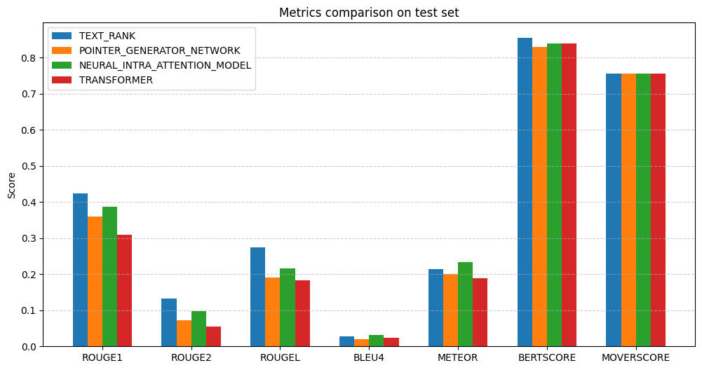
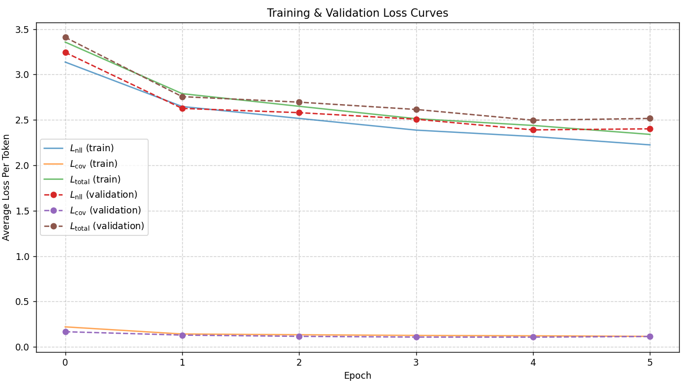
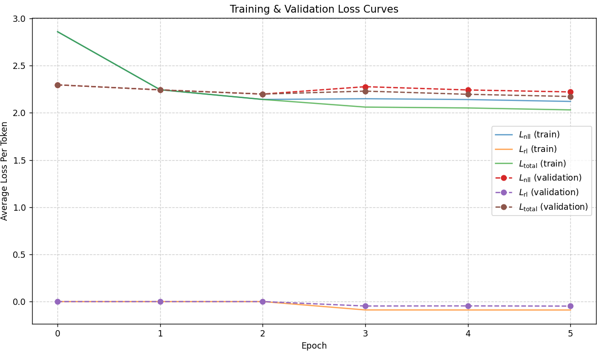
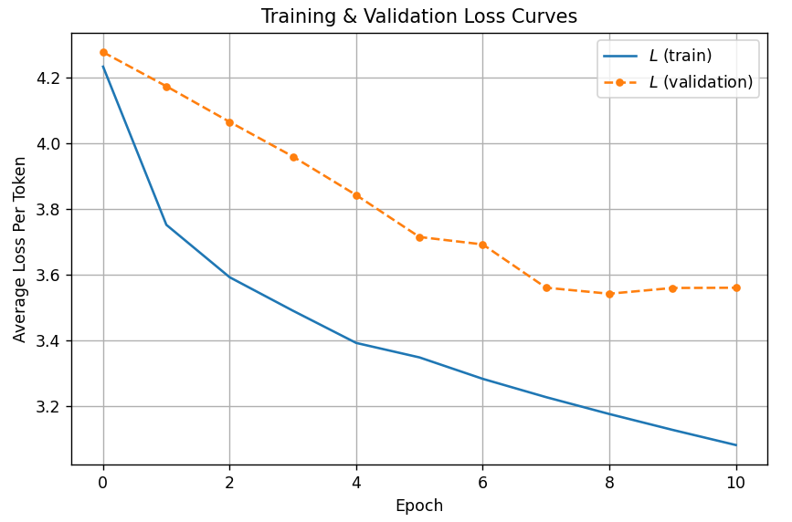

# Advanced Text Summarization with Deep Learning 📝

[](https://www.python.org/downloads/)
[](https://pytorch.org/)
[](https://opensource.org/licenses/MIT)

**Author:** Nguyễn Văn Đức

An applied research project focusing on modern architectures for Abstractive Text Summarization. This repository implements, trains, and comprehensively evaluates various sequence-to-sequence neural network topologies, transitioning from traditional statistical methods to state-of-the-art attention mechanisms.

---

## 📄 Project Report & Paper
For a deep dive into the mathematical foundations of the architectures, training strategies, and comprehensive evaluations, please refer to our full project report (in Vietnamese): 
👉 **[Read the Full Report](docs/Text_Summarization_Report_VN.pdf)**

## 📌 Implemented Architectures

1. **Transformer (Self-Attention)**: Built from scratch with `ByteLevelBPETokenizer`.
2. **Pointer-Generator Network with Coverage**: Addresses OOV (Out-of-Vocabulary) words and repetition phenomena in classical Seq2Seq models.
3. **Neural Intra-Attention Model**: Employs a mixed objective function integrating Reinforcement Learning (RL) loss and Negative Log-Likelihood (NLL) loss.
4. **TextRank**: Baseline graph-based extractive summarization.

## 📊 Dataset & Infrastructure

- **Dataset**: [CNN/Daily Mail Dataset](https://huggingface.co/datasets/abisee/cnn_dailymail) (Train: 287k, Val: 13k, Test: 11k samples).
- **Framework**: PyTorch.
- **Evaluation Metrics**: ROUGE (1, 2, L), BLEU-4, METEOR, BERTScore, MoverScore.

---

## 🚀 Getting Started

### 1. Environment Setup
Clone the repository and install the required dependencies:

```bash
git clone https://github.com/nguyenduc13475/Text-Summarization.git
cd Text-Summarization
pip install -r requirements.txt
```

### 2. 📥 Download Pre-trained Models

To skip training and jump straight to inference or evaluation, you can download the pre-trained weights.

- For Transformer:

```bash
mkdir -p transformer_checkpoints
wget https://github.com/nguyenduc13475/Text-Summarization/releases/download/v1.0/transformer_checkpoint_latest.pt -O transformer_checkpoints/checkpoint_0.pt
```

- For Pointer Generator Network:

```bash
mkdir -p pointer_generator_network_checkpoints
wget https://github.com/nguyenduc13475/Text-Summarization/releases/download/v1.0/pointer_generator_network_checkpoint_latest.pt -O pointer_generator_network_checkpoints/checkpoint_0.pt
```

- For Neural Intra-Attention Model:

```bash
mkdir -p neural_intra_attention_model_checkpoints
wget https://github.com/nguyenduc13475/Text-Summarization/releases/download/v1.0/neural_intra_attention_model_checkpoint_latest.pt -O neural_intra_attention_model_checkpoints/checkpoint_0.pt
```

---

## 💻 Usage

### Inference (Generate Summaries)

Run the CLI to generate summaries from custom text or test-set samples. The engine supports attention heatmap and t-SNE embedding visualizations.

```bash
# Run inference with a specific model
python inference.py --model TRANSFORMER

# Run inference on custom text using all models
python inference.py --model ALL --text "Insert your custom long text here to summarize..."

# Run inference without rendering matplotlib visualizations
python inference.py --disable-plots
```

### Training

Train models from scratch or resume from a checkpoint. Hyperparameters are managed via `configs/config.yaml`.

```bash
python training.py --config configs/config.yaml
```

### Evaluation & Validation

Evaluate models on the test set and generate comparison metrics:

```bash
# Standard evaluation on test set
python evaluation.py

# Perform K-Fold Cross Validation
python cross_validation.py

# Validate checkpoints over epochs (real-time metric visualization)
python checkpoint_validation.py
```

---

## 📈 Results & Visualizations

### Results of comparing models on the Test Set


### Training Loss Curves

Pointer-Generator Network Loss Curves



Neural Intra-Attention Model Loss Curves



Transformer Loss Curves



---

## ⚙️ Execution Environment

* Can run on a **local machine** or **Google Colab**.
* The system supports automatic device recognition (**CPU/GPU**) and optimization via Automatic Mixed Precision (AMP).
* It is recommended to use a GPU (NVIDIA T4, A100, etc.) to increase training and inference speed.